# PanoFlexWorld: Text/Image to 3D Navigable World Pipeline

[](https://github.com/Tencent/HunyuanWorld)
[](https://github.com/ml-gsai/FlexWorld)

## 📋 Project Overview

**PanoFlexWorld** is an integrated pipeline that transforms text prompts or images into fully navigable 3D virtual worlds. By combining Tencent's HunyuanWorld panorama generation with FlexWorld's 3D scene expansion capabilities, users can generate immersive 3D environments and freely explore them from any viewpoint.

### 🎯 Goal
Input a text prompt or image → Generate a complete 3D world → Navigate freely within it

## 🔬 Technical Approach

### Core Innovation
We leverage the power of two cutting-edge technologies:

1. **HunyuanWorld**: Tencent's powerful text/image-to-panorama model that generates high-quality 360° equirectangular panoramas (1920×960)
2. **FlexWorld**: Advanced 3D scene expansion framework using Gaussian Splatting for flexible view synthesis

### Pipeline Architecture

```mermaid
graph LR
    A[Text/Image Input] --> B[HunyuanWorld]
    B --> C[360° Panorama]
    C --> D[MoGe Depth Estimation]
    D --> E[Depth Map]
    C & E --> F[Point Cloud Generation]
    F --> G[3D Point Cloud]
    G --> H[FlexWorld Rendering]
    H --> I[Navigable 3D World]
```



### Technical Details

#### 1. Panorama Generation
- Converts text prompts or images into 360° equirectangular panoramas
- Fixed resolution: 1920×960 pixels
- Uses FLUX.1-dev base model with HunyuanWorld LoRA weights

#### 2. Depth Estimation
- Employs MoGe model for monocular depth estimation
- Generates per-pixel depth values for the entire panorama
- Outputs depth map in `.npy` format with visualization

#### 3. Point Cloud Construction
- Converts panorama + depth into 3D point cloud
- Spherical to Cartesian coordinate transformation
- Each pixel becomes a 3D point with RGB color
- Outputs in PLY/PCD format (~1.8M points for full resolution)

#### 4. 3D Rendering & Navigation
- Uses Gaussian Splatting for real-time rendering
- Supports flexible camera trajectories (orbit, forward, custom paths)
- Generates navigable videos and reconstructed panoramas

## 🚀 Quick Start

### Prerequisites
```bash
# Install dependencies (see INSTALL.md for details)
conda create -n hunyuanworld python=3.9
conda activate hunyuanworld

# Install required packages
pip install -r requirements.txt
```

### One-Command Pipeline

We provide a unified script `pipeline.sh` that automates the entire process:

```bash
# From text prompt
./pipeline.sh --mode text --input "a beautiful street scene" --scene street

# From image
./pipeline.sh --mode image --input "/path/to/image.jpg" --scene custom

# From existing panorama
./pipeline.sh --mode existing --input "/path/to/panorama.png" --scene pano
```

## 📁 Project Structure

```
HunyuanWorld-1.0/
├── pipeline.sh                   # 🎯 Main pipeline script
├── demo_panogen_local.py         # Panorama generation
├── generate_pano_depth.py        # Depth estimation
├── generate_pano_pointcloud.py   # Point cloud generation
├── ljj.sh                        # FlexWorld rendering script
├── FlexWorld/
│   ├── ljj.py                   # Core integration code
│   └── testOutput/              # Rendered outputs
│       ├── test_video.mp4       # 360° orbit video
│       ├── test_video_mask.mp4  # Mask video
│       └── panorama_output/     # Reconstructed panorama
└── test_results/                # Generated assets
    └── [scene_name]/
        ├── panorama.png         # Generated panorama
        ├── depth/               # Depth maps
        └── pointcloud/          # 3D point clouds
```

## 🔧 Pipeline Components

### 1. Text/Image → Panorama (`demo_panogen_local.py`)
```bash
python demo_panogen_local.py \
    --prompt "mountain landscape with snow" \
    --output_path test_results/mountain \
    --seed 42 \
    --use_local
```

### 2. Panorama → Depth (`generate_pano_depth.py`)
```bash
python generate_pano_depth.py \
    --image_path test_results/mountain/panorama.png \
    --output_path test_results/mountain/depth \
    --verbose
```

### 3. Panorama + Depth → Point Cloud (`generate_pano_pointcloud.py`)
```bash
python generate_pano_pointcloud.py \
    --rgb_path test_results/mountain/panorama.png \
    --depth_path test_results/mountain/depth/panorama_depth.npy \
    --output_path test_results/mountain/pointcloud
```

### 4. Point Cloud → 3D World (`FlexWorld/ljj.py`)
```bash
cd FlexWorld
python ljj.py  # Automatically loads the point cloud
```

## 🎮 Camera Controls

The system supports various camera trajectories:

- **360° Orbit**: Circular path around the scene
- **Forward Motion**: Move into the scene
- **Custom Paths**: Define your own trajectory

```python
# In FlexWorld/ljj.py
traj_orbit = plan.add_traj().move_orbit_to(0, 360, 0.5, num_frames=72).finish()
```

## 🐛 Known Issues & Solutions

### Black Regions in Rendered Videos
**Cause**: Large depth discontinuities create gaps when rotating the camera

**Current Solutions**:
- Coordinate system alignment (90° X-axis, -90° Y-axis rotation)
- Adjusted camera trajectory parameters

**Future Work**:
- Implement inpainting for gap filling
- Sky layer separation for unbounded scenes
- Depth-aware point cloud densification

### Panorama Reconstruction Quality
**Issue**: FlexWorld's `video2pano` expects specific perspective views

**Solution**: Select 8 key frames from orbit video at correct angles (0°, 45°, 90°, etc.)

## 🔮 Future Enhancements

1. **Iterative Scene Expansion**
   - Inpainting-based hole filling
   - Depth estimation for new regions
   - Consistent 3D structure updates

2. **Sky Handling**
   - Separate sky layer processing
   - Infinite depth modeling
   - Multi-layer rendering

3. **Real-time Navigation**
   - Interactive 3D viewer
   - VR/AR support
   - Dynamic scene updates

## 📊 Performance

- **Panorama Generation**: ~30 seconds
- **Depth Estimation**: ~10 seconds  
- **Point Cloud Generation**: ~5 seconds
- **3D Rendering**: ~10 seconds for 72-frame video
- **Total Pipeline**: ~1 minute

## 🤝 Acknowledgments

This project integrates:
- [HunyuanWorld](https://github.com/Tencent/HunyuanWorld) by Tencent
- [FlexWorld](https://github.com/ml-gsai/FlexWorld) by ML-GSAI
- [MoGe](https://github.com/microsoft/MoGe) for depth estimation
- [Gaussian Splatting](https://github.com/graphdeco-inria/gaussian-splatting) for rendering

## 📝 Citation

If you use this pipeline in your research, please cite:

```bibtex
@misc{panoflexworld2025,
  title={PanoFlexWorld: Text/Image to 3D Navigable World Pipeline},
  author={Your Name},
  year={2025},
  url={https://github.com/yourusername/PanoFlexWorld}
}
```

## 📜 License

This project is released under the MIT License. See LICENSE file for details.

---
*Last Updated: 2025-08-10*
*Status: Active Development*